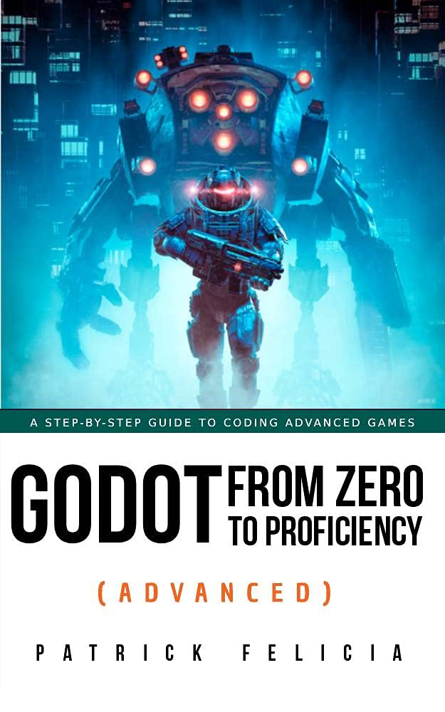

# Advanced

## Overview
Studies based on book series "Godot from Zero to Proficiency".

## Chapters
### Chapter 1: Reading files and creating scenes procedurally
### Chapter 2: Accessing and updating a database
### Chapter 3: Creating a networked multiplayer game
### Chapter 4: Creating a memory game
### Chapter 5: Creating a platformer
### Chapter 6: FAQ
### Chapter 7: Thank You
This chapter is skipped as it contains no commands, tutorials or code.

## Book Information
Name: Godot from Zero to Proficiency (Advanced)  
Author: Patrick Felicia  
Cover:  

