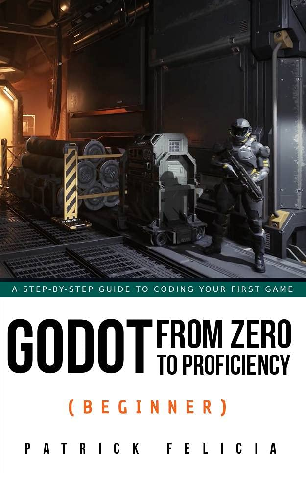

# Beginner

## Chapters
### Chapter 1: Introduction to programming in GDScript
Basics of GDScript and some common programming topics as they relate to GDScript.

### Chapter 2: Creating your first script
How to create a GDScript.

### Chapter 3: Adding interaction with GDScript
Adding a GDScript to a project.

### Chapter 4: Creating and updating a user interface from your code
Creating and updating a dynamic GUI with GDScript

### Chapter 5: Polishing our game
### Chapter 6: FAQ

## Book Information
Name: Godot from Zero to Proficiency (Beginner)  
Author: Patrick Felicia  
Cover:  

