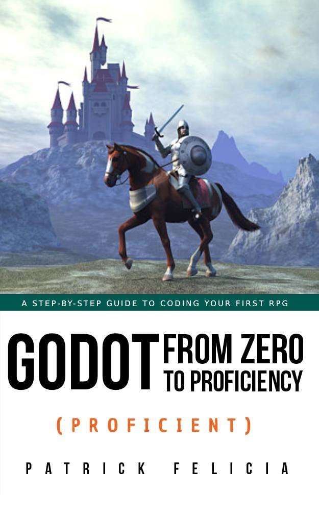

# Proficient

## Chapters
### Chapter 1: Introduction to the rpg genre, key features and design concepts
### Chapter 2: Creating and animating the main character
### Chapter 3: Creating a dialogue system
### Chapter 4: Creating an inventory system
### Chapter 5: Creating a shap and a buying system
### Chapter 6: Adding weapons and protagonists
### Chapter 7: Adding a quest system
### Chapter 8: Creating an xp attribution system
### Chapter 9: Creating the final level
### Chapter 10: Your next steps

## Book Information
Name: Godot from Zero to Proficiency (Proficient)  
Author: Patrick Felicia  
Cover:  

