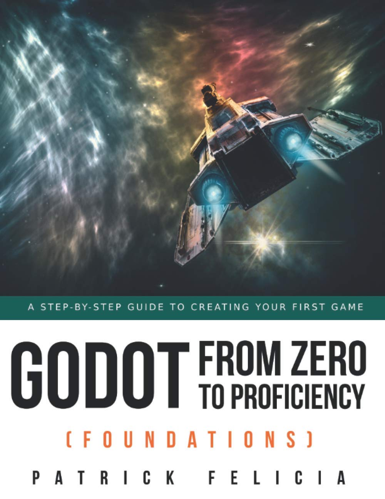

# Foundations

## Overview
Studies based on book series "Godot from Zero to Proficiency".

## Chapters
### Chapter 1: Benefits of using Godot
This chapter is skipped as it contains no commands, tutorials or code.
### Chapter 2: Installing Godot and becoming familiar with the interface
How to install GoDot and a rundown of GoDot's interface.  
### Chapter 3: Creating and exporting your first scene
Creating and exporting a scene in GoDot
### Chapter 4: Transforming Built-in Objects to create and indoor scene
Build a 3d scene with lighting and movement.
### Chapter 5: Creating an outdoor scene with Godot's Built-in Terrain generator
Build a 3d scene with water, elevation and terrain.
### Chapter 6: FAQ
Frequently Asked Questions w/ answers.
### Chapter 7: Thank You
This chapter is skipped as it contains no commands, tutorials or code.

## Book Information
Name: Godot from Zero to Proficiency (Foundations)  
Author: Patrick Felicia  
Cover:  

