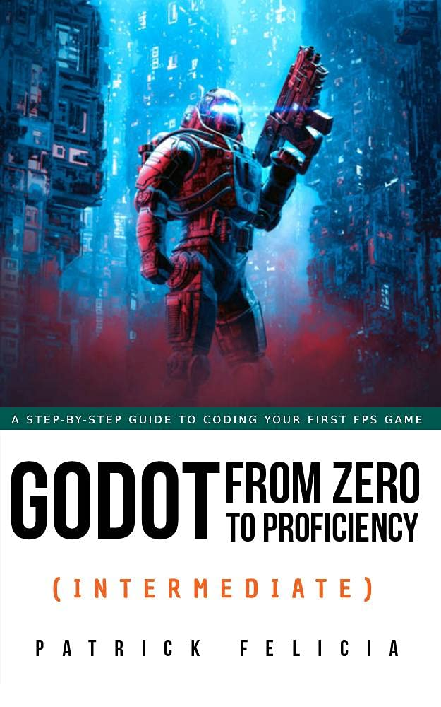

# Intermediate

## Chapters
### Chapter 1: Adding simple artificial intelligence
### Chapter 2: Creating and managing weapons
### Chapter 3: Using finite state machines
### Chapter 4: More artificial intelligence
### Chapter 5: FAQ
### Chapter 6: Creating and exporting multiple animations with Mixamo
### Chapter 7: Thank you
This chapter is skipped as it contains no commands, tutorials or code.

## Book Information
Name: Godot from Zero to Proficiency (Intermediate)  
Author: Patrick Felicia  
Cover:  

